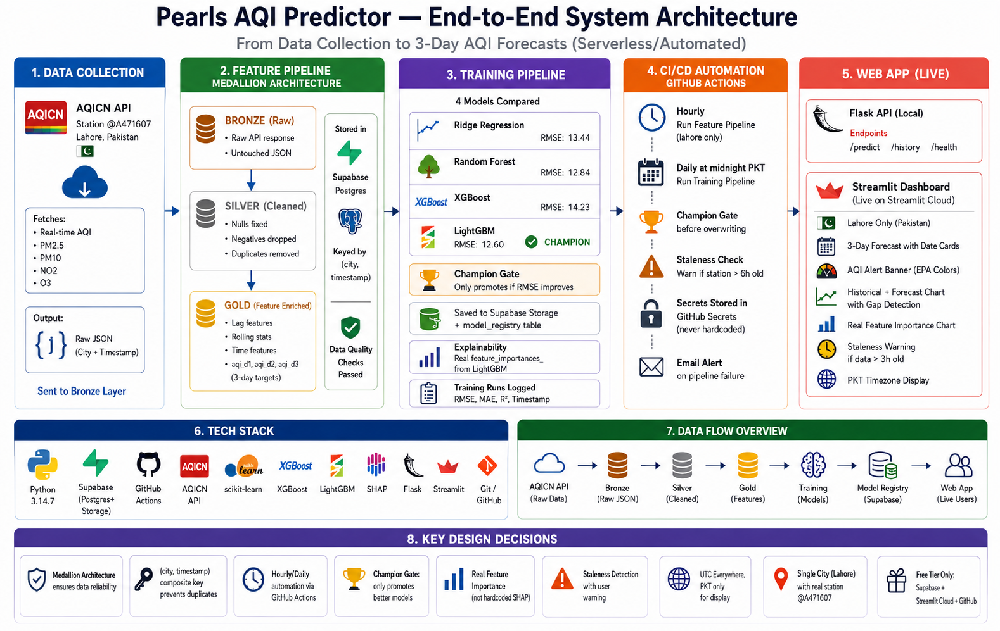

# Pearls AQI Predictor

**Three-Day Air Quality Index (AQI) Forecasting System for Lahore,
Pakistan**

Pearls AQI Predictor is an end-to-end automated machine learning system
that forecasts AQI for Lahore for the next three days.

It collects real AQI observations, adds temperature and humidity data,
processes the data through a Bronze--Silver--Gold pipeline, trains
multiple regression models, selects a champion model, and displays
forecasts through a Streamlit dashboard.

> **Important:** The current historical backfill contains synthetic AQI
> values for pipeline bootstrapping. Therefore, the reported model
> metrics are preliminary and should not be treated as final production
> accuracy.

------------------------------------------------------------------------

## Features

-   Real-time AQI collection from AQICN
-   Temperature and humidity from Open-Meteo
-   Lahore station validation
-   Bronze--Silver--Gold medallion data architecture
-   Time-series feature engineering
-   24-hour, 48-hour, and 72-hour AQI targets
-   Multiple regression models
-   Time-aware train/test evaluation
-   Five-fold `TimeSeriesSplit` cross-validation
-   Automatic champion-model selection
-   Model versioning and registry
-   Supabase database and model storage
-   SHAP/model feature importance
-   Streamlit forecasting dashboard
-   Flask REST API
-   Data-staleness checks
-   Duplicate-safe upserts
-   Automated GitHub Actions pipelines
-   Unit tests for important feature-pipeline logic

------------------------------------------------------------------------

## System Architecture



### Data Layers

  Layer       Storage                Purpose
  ----------- ---------------------- -----------------------------------
  Bronze      `aqi_bronze_raw`       Original AQICN response
  Silver      `aqi_silver_cleaned`   Cleaned and validated data
  Gold        `aqi_gold_features`    Model features and future targets
  Training    `training_runs`        Training metrics and run metadata
  Registry    `model_registry`       Champion model metadata
  Artifacts   Supabase Storage       Serialized models and encoders

Records use `(city, timestamp)` as the logical composite key.

------------------------------------------------------------------------

## Data Sources

### AQICN

AQICN provides the main AQI and station data.

Default Lahore station:

``` text
@A471607
```

The station is validated against Lahore before the data is accepted.

### Open-Meteo

The project uses Open-Meteo for:

-   Temperature at 2 meters
-   Relative humidity
-   Asia/Karachi local time

If the Open-Meteo request fails, available AQICN weather values can be
used as a fallback.

------------------------------------------------------------------------

## Feature Engineering

The model currently uses 10 input features:

  Feature               Purpose
  --------------------- ---------------------------
  `city_encoded`        City context
  `hour`                Daily pollution pattern
  `day_of_week`         Weekly pattern
  `month`               Seasonal pattern
  `aqi_lag_1h`          Recent AQI behavior
  `aqi_lag_24h`         Previous-day AQI behavior
  `aqi_roll_mean_24h`   Recent AQI average
  `aqi_change_rate`     AQI direction/change
  `temperature`         Weather information
  `humidity`            Weather information

The strongest reported predictors are `aqi_lag_1h` and
`aqi_roll_mean_24h`.

------------------------------------------------------------------------

## Machine Learning

The training pipeline compares several models:

1.  Naive mean baseline
2.  Ridge Regression
3.  Random Forest
4.  XGBoost
5.  LightGBM
6.  HistGradientBoosting fallback when LightGBM is unavailable

The system uses supervised multi-output regression for:

``` text
AQI +24 hours
AQI +48 hours
AQI +72 hours
```

### Evaluation

Random shuffling is avoided because this is a time-series forecasting
problem.

The data is sorted chronologically:

``` text
First 80%  -> Training
Last 20%   -> Testing
```

Five-fold `TimeSeriesSplit` cross-validation is also performed.

Metrics:

-   RMSE
-   MAE
-   R²

The main model-selection score is the average RMSE across the three
forecast horizons.

------------------------------------------------------------------------

## Reported Results

The project documentation reports:

  Model                Average RMSE
  ------------------ --------------
  Naive Baseline              20.31
  Random Forest               11.32
  LightGBM                    11.88
  XGBoost                     11.94
  Ridge Regression            12.59

Random Forest achieved approximately a **44% lower RMSE** than the naive
baseline in the reported comparison.

The reported current champion results are:

  Forecast      RMSE     R²
  ---------- ------- ------
  Day 1        12.02   0.63
  Day 2        11.01   0.69
  Day 3        10.85   0.73

These results are preliminary because synthetic historical data was used
for initial backfilling.

------------------------------------------------------------------------

## Champion Model

A new model is promoted only when it improves the current champion.

``` text
Train models
     |
     v
Compare average RMSE
     |
     v
Is new model better?
    / \
  Yes  No
   |    |
   v    v
Promote  Keep
model    current
```

When a model is promoted:

-   A version is created
-   The model is serialized with Joblib
-   The label encoder is saved
-   Artifacts are uploaded to Supabase Storage
-   Metadata is stored in `model_registry`

------------------------------------------------------------------------

## Automation

GitHub Actions automates the main workflow.

### Hourly

``` text
Feature Pipeline
```

Collects and processes new Lahore data.

### Daily

``` text
Training Pipeline
```

Compares models and evaluates whether a new champion should be promoted.

The automation also includes:

-   Staleness checks
-   Secret management
-   Failure alerts
-   Champion protection

------------------------------------------------------------------------

## Streamlit Dashboard

The dashboard provides:

-   Current AQI
-   Temperature
-   Three-day forecast
-   Forecast dates
-   AQI alert category
-   Recent AQI history
-   Historical + forecast chart
-   AQI threshold lines
-   Feature importance
-   Data freshness warning
-   Model version
-   Pakistan local time

The dashboard loads the latest model and feature data from Supabase.

------------------------------------------------------------------------

## Flask REST API

The Flask API provides three main endpoints.

### Health

``` http
GET /health
```

Returns API and model status.

### Prediction

``` http
GET /predict?city=lahore
```

Returns:

-   City
-   Source timestamp
-   Day 1 forecast
-   Day 2 forecast
-   Day 3 forecast
-   Maximum forecast AQI
-   Alert level

Example:

``` json
{
  "city": "lahore",
  "as_of": "2026-08-24T10:00:00+00:00",
  "forecast": [
    {"day": 1, "date": "2026-08-25", "aqi": 135},
    {"day": 2, "date": "2026-08-26", "aqi": 146},
    {"day": 3, "date": "2026-08-27", "aqi": 133}
  ],
  "max_aqi": 146,
  "alert_level": "Unhealthy for Sensitive Groups"
}
```

### History

``` http
GET /history?city=lahore
```

Returns the latest 24 AQI records.

------------------------------------------------------------------------

## AQI Categories

         AQI Category
  ---------- --------------------------------
       0--50 Good
     51--100 Moderate
    101--150 Unhealthy for Sensitive Groups
    151--200 Unhealthy
    201--300 Very Unhealthy
        301+ Hazardous

------------------------------------------------------------------------

## Explainability

The project uses SHAP where supported.

For tree models:

``` text
SHAP TreeExplainer
```

For linear models:

``` text
SHAP LinearExplainer
```

Fallbacks include:

-   Tree feature importance
-   Absolute regression coefficients

Feature importance describes model behavior. It does not prove
causation.

------------------------------------------------------------------------

## Project Structure

``` text
pearls-aqi-predictor/
│
├── api/
│   └── app.py
│
├── dashboard/
│   └── streamlit_app.py
│
├── features/
│   ├── fetch_aqi.py
│   └── engineer_features.py
│
├── pipelines/
│   ├── feature_pipeline.py
│   ├── backfill.py
│   ├── training_pipeline.py
│   └── cleanup.py
│
├── models/
│   └── explain.py
│
├── test/
│   └── test_features.py
│
├── requirements.txt
└── README.md
```

------------------------------------------------------------------------

## Installation

### 1. Clone the repository

``` powershell
git clone https://github.com/Hammad-700/pearls-aqi-predictor.git
Set-Location pearls-aqi-predictor
```

### 2. Create a virtual environment

``` powershell
py -3.14 -m venv venv
.\venv\Scripts\Activate.ps1
```

### 3. Install dependencies

``` powershell
pip install -r requirements.txt
```

------------------------------------------------------------------------

## Environment Variables

Create a `.env` file for the Flask service and pipelines:

``` text
AQICN_TOKEN=your_token
SUPABASE_URL=https://your-project.supabase.co
SUPABASE_KEY=your_service_role_key
LAHORE_AQI_STATION_ID=@A471607
```

For Streamlit deployment, configure:

``` text
SUPABASE_URL
SUPABASE_KEY
```

through Streamlit secrets.

**Do not commit API tokens, Supabase keys, or other secrets to Git.**

------------------------------------------------------------------------

## Running the Pipelines

### Feature pipeline

``` powershell
python pipelines/feature_pipeline.py lahore
```

### Historical backfill

``` powershell
python pipelines/backfill.py lahore
```

### Model training

``` powershell
python pipelines/training_pipeline.py
```

------------------------------------------------------------------------

## Run the Flask API

``` powershell
python api/app.py
```

------------------------------------------------------------------------

## Run the Streamlit Dashboard

``` powershell
streamlit run dashboard/streamlit_app.py
```

------------------------------------------------------------------------

## Run Tests

``` powershell
pytest
```

Compile-check the dashboard:

``` powershell
python -m py_compile dashboard/streamlit_app.py
```

------------------------------------------------------------------------

## Data Quality Checks

The project checks:

-   AQI validity
-   Negative sensor values
-   Station coordinates
-   Source timestamp freshness
-   Duplicate records
-   Weather coverage
-   Minimum training data
-   Model availability

Current thresholds include:

``` text
Minimum training rows: 100
Minimum complete-weather coverage: 80%
Stale station warning: 6 hours
Dashboard staleness warning: 3 hours
```

------------------------------------------------------------------------

## Limitations

The current system has several important limitations:

1.  Historical AQI backfill is initially synthetic.
2.  Only Lahore is supported.
3.  The system uses one configured station.
4.  Station readings may arrive every four to six hours.
5.  The feature set does not currently include wind, precipitation,
    pressure, traffic, or satellite information.
6.  Missing numeric values are currently filled with zero.
7.  The API is implemented locally and is not publicly deployed.
8.  Predictions are point estimates without uncertainty intervals.

------------------------------------------------------------------------

## Future Work

Planned improvements include:

-   Replace synthetic history with verified historical observations
-   Add multiple Lahore stations
-   Add support for more cities
-   Add wind and precipitation features
-   Add pollutant-specific features
-   Add prediction intervals
-   Add threshold-crossing probabilities
-   Add model and data-drift monitoring
-   Add API authentication and rate limiting
-   Add integration tests
-   Improve missing-value handling
-   Add stronger model reproducibility metadata
-   Add alerts for missing station updates

------------------------------------------------------------------------

## Ethical and Safety Note

AQI forecasts can influence health-related decisions. This project
should therefore be treated as an **informational forecasting system**,
not a medical diagnostic tool.

The application should communicate:

-   Data timestamp
-   Data freshness
-   Model limitations
-   Forecast uncertainty when available

Users should not treat a model prediction as a guarantee of future air
quality.

------------------------------------------------------------------------

## Technology Stack

  Technology              Purpose
  ----------------------- ---------------------------
  Python                  Main programming language
  Pandas / NumPy          Data processing
  scikit-learn            Machine learning
  Random Forest           Regression model
  XGBoost                 Regression model
  LightGBM                Regression model
  SHAP                    Explainability
  Supabase / PostgreSQL   Data and model storage
  AQICN                   AQI data
  Open-Meteo              Weather data
  Flask                   REST API
  Streamlit               Dashboard
  GitHub Actions          Automation
  Git / GitHub            Version control

------------------------------------------------------------------------

## Project Status

**Current status:** Working end-to-end prototype / portfolio project.

The main pipeline is implemented from data collection through
forecasting and dashboard presentation. The most important next step for
stronger scientific evaluation is replacing synthetic historical
backfill with verified historical AQI observations.

------------------------------------------------------------------------

## Author

**Muhammad Hammad Khalid**

Project: **Pearls AQI Predictor**

Location: **Lahore, Punjab, Pakistan**
